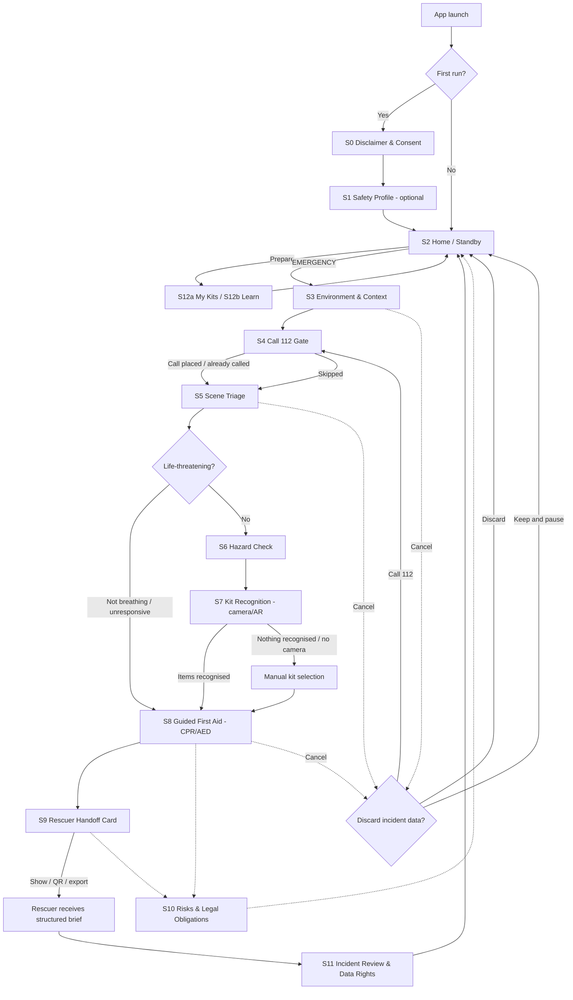

# ResQKit — MVP Screen List, User Flow and Data Collection (Release 1)

**Status:** MVP scope definition (documentation only — no application code yet)
**Date:** 2026-08-12

## 0. Purpose and Guardrails

This document defines *exactly* what ships in the first release of ResQKit: which screens exist, what happens in each step, and which data each step collects.

Non-negotiable guardrails carried over from the project's requirements and the compliance baseline:

1. **ResQKit is complementary to 112, never a replacement.** Every emergency path in the MVP puts the official emergency call first. ResQKit never claims to dispatch help, never silently transmits to a PSAP, and never tells the user they can skip calling 112. The app's job is to make the *human* call to 112 faster and better-informed, and to structure information for the rescuers who arrive.
2. **No generated law, no generated medical protocol.** Every regulatory statement and every first-aid step shown in the app is served from a curated, versioned content pack with an attributed source. Where the MVP cannot cite a source, it shows nothing rather than an inference. Rationale: the product premise (see `ResQKit_App_Outline_and_Search_Plan.md`, §3) is regulation-driven guidance that avoids "hallucinations".
3. **Privacy by design and by default** (GDPR Art. 25, cited in `eu_regulations_emergency_response_data_handling_report.md` §5.3). MVP default is *on-device only*. Nothing leaves the device unless the user performs an explicit, visible share action.
4. **Data minimisation** (GDPR Art. 5(1)(c)). Only fields that a rescuer actually needs are collected. The field set is derived from `web_info_summaries/essential_emergency_responder_information.md`: exact location, number of victims, type of injury, victim medical history, specific hazards.
5. **AR in MVP means mobile-camera, marker-light object recognition on a known kit inventory** — not head-mounted displays. Per `web_info_summaries/Augmented_Reality_in_Emergency_First_Aid_and_Kit_Recognition.md`, smartphones act as three-axis AR systems with heads-up-style overlay, and HMD hardware (HoloLens class) plus cost and computational demand are listed limitations. The MVP therefore keeps recognition on a phone camera with a mandatory manual fallback.

---

## 1. MVP Screen List

Twelve screens. Each entry states purpose, key UI elements, and the single primary action.

### S0 — Welcome, Disclaimer & Consent
- **Purpose:** Establish the legal frame before any data is touched. Make the "112 first" positioning unmissable.
- **Key UI:** App identity block; short plain-language disclaimer ("ResQKit assists — it does not call or dispatch emergency services; always call 112"); layered privacy notice with expandable detail; two separate toggles — (a) required acknowledgement of the disclaimer, (b) *optional* explicit consent to store health data in a Safety Profile; link to full privacy notice and data-rights screen.
- **Primary action:** *Acknowledge and continue*.
- **Notes:** The two toggles must be independent. Refusing the health-data consent must still allow full use of the emergency flow, because the emergency flow relies on vital interests, not consent.

### S1 — Safety Profile (optional)
- **Purpose:** Let a user pre-record the small set of medical facts that materially change treatment, so a rescuer does not have to discover them at the scene.
- **Key UI:** Profile card for self and optionally household members; fields for blood type, known allergies, chronic conditions, current medications, implants/devices, emergency contact, preferred language; per-field "leave blank" affordance; persistent "stored only on this device" badge; delete-profile button.
- **Primary action:** *Save profile locally*.
- **Notes:** Entirely skippable. Justified by the responder-information research, which identifies pre-existing conditions, allergies and current medications as decisive for treatment decisions.

### S2 — Home / Standby
- **Purpose:** The resting state of the app. Two distinct doors: emergency now, or learn/prepare.
- **Key UI:** Large primary **EMERGENCY** button; secondary **Call 112** button that dials directly without entering the wizard; environment quick-switch chips (Car / Office / Sea / Mountain); "My kits" tile; "Learn & practise" tile; status strip showing content-pack version, last update date and offline-ready state.
- **Primary action:** *Start emergency assist*.
- **Notes:** No login. Cold-start to first useful guidance must be reachable without any account.

### S3 — Environment & Context
- **Purpose:** Establish which world the incident is in, because the available kit, the hazards and the legal obligations all differ.
- **Key UI:** Four large context tiles — Road/Vehicle, Workplace/Office, Maritime, Mountain/Outdoor; "other/unknown" escape hatch; auto-suggestion from coarse signals (e.g. movement pattern or last selected context) shown as a *suggestion the user confirms*, never as a silent decision.
- **Primary action:** *Confirm context*.

### S4 — Call 112 Gate
- **Purpose:** Enforce guardrail 1 structurally rather than as a footnote.
- **Key UI:** Full-screen prompt "Have you called 112?"; one-tap dialler; a short read-aloud script pre-filled with what is already known (context, coarse location, victim count if captured); "already called" and "someone else is calling" options; explicit note that ResQKit does not transmit anything to emergency services.
- **Primary action:** *Call 112 now* (secondary: *Already called — continue*).
- **Notes:** This screen cannot be permanently dismissed. If the user proceeds without calling, a persistent banner offering the dialler remains visible for the rest of the session.

### S5 — Scene Triage
- **Purpose:** Capture, in the fewest possible taps, the facts rescuers prioritise.
- **Key UI:** Stepped single-question cards — number of victims (stepper); for the primary victim: responsive / not responsive, breathing / not breathing / unsure; visible injury category (bleeding, fracture, burn, head/spine, chest, unknown); approximate age band; trapped or freely accessible. Every card has "unsure" as a first-class answer. Progress indicator plus "skip to guidance" for users who must act immediately.
- **Primary action:** *Continue*.
- **Notes:** Field selection follows the responder-information summary (victim count, injury type, triage-relevant severity). Initial victim counts are known to be over-estimated in real reports, so the app records the user's count as *reported*, never as verified.

### S6 — Hazard Check
- **Purpose:** Protect the helper and inform the rescuers, before any hands-on action.
- **Key UI:** Context-filtered hazard checklist as multi-select toggles — traffic, fire/smoke, fuel or chemical spill, electrical/high-voltage or EV battery, water/drowning risk, unstable structure, cold/heat exposure, gas; a prominent "do not enter / do not move the victim" warning card triggered by the relevant selections.
- **Primary action:** *Confirm hazards*.
- **Notes:** Hazard taxonomy is drawn from the responder-information research (CBRNE, structural, environmental and other hazards) and reduced to what an untrained bystander can actually observe. EV/high-voltage is called out separately because extrication procedures differ for electric vehicles.

### S7 — Kit Recognition (camera / AR)
- **Purpose:** Ground the guidance in what the user physically has, instead of a generic checklist.
- **Key UI:** Camera viewfinder with live overlay labels on recognised items; confidence indication; recognised-items list that accumulates below; **always-visible "Select manually" button**; per-item detail sheet (what it is, what it is for, how to use it); "kit not found / empty" path.
- **Primary action:** *Use these items*.
- **Notes:** Recognition is scoped to a fixed inventory of common kit contents for the four MVP contexts (e.g. car kit, office kit, life-jacket/maritime, mountain pack). Manual selection is not a degraded mode — it is a co-equal path, because lighting, occlusion and reflections are documented accuracy limitations of AR overlays.

### S8 — Guided First Aid
- **Purpose:** Walk an untrained person through the correct procedure, using only items confirmed available.
- **Key UI:** One step per screen, large type, high contrast; illustration or short loop per step; audio read-aloud and hands-free "next" via voice; metronome/timer for compressions; "I can't do this / try alternative" branch; source attribution and content-pack version on every procedure; sticky "Call 112" affordance.
- **Primary action:** *Next step* (with *Step completed* confirmation on critical steps).
- **Notes:** MVP procedure set is deliberately narrow: unresponsive/not breathing (CPR + AED prompt), severe bleeding control, choking, burns, fracture immobilisation, hypothermia. These mirror the procedures identified as the archetypal AR-guided first-aid cases (CPR/AED, severe haemorrhage). Items the user does *not* have are hidden from the step, and an item-free alternative is shown where one legitimately exists.

### S9 — Rescuer Handoff Card
- **Purpose:** The core deliverable to rescuers. Turn everything captured into one structured, readable summary.
- **Key UI:** Single-screen card, glanceable at arm's length, with sections — location (coordinates + plain-text description + what3words-style human hint if available), context, reported victim count, victim status/injury, hazards present, interventions already performed with timestamps, Safety Profile medical facts (only if the user consented and chooses to include), reporter contact; **big "Show to rescuer" full-brightness mode**; read-aloud button; share sheet (QR code / local export) as an explicit action; per-section include/exclude toggles before sharing.
- **Primary action:** *Show to rescuer*.
- **Notes:** Sharing is always a deliberate user action. Health data is excluded from the card by default and must be switched on. Standardised exchange to PSAPs and hospital systems is explicitly out of MVP scope (§4).

### S10 — Risks & Legal Obligations
- **Purpose:** Answer "what am I required and permitted to do here?" from cited sources, to speed up decisions.
- **Key UI:** Context-filtered list of obligation cards (e.g. scene-securing duties, mandatory kit contents, reporting duties, duty-to-assist framing); each card shows a one-line plain-language summary, the instrument or source reference, and its last-verified date; a visible "no verified source available for this context" empty state; search.
- **Primary action:** *Open obligation detail*.
- **Notes:** Content-pack driven and read-only in MVP. Cards render only what exists in the pack. This screen also carries the standing disclaimer that ResQKit provides information, not legal advice.

### S11 — Incident Review & Data Rights
- **Purpose:** Close the loop and make GDPR rights operable rather than theoretical.
- **Key UI:** Timeline of the just-finished incident; export as file; **Delete this incident** and **Delete everything**; retention setting for incident records (default: delete on close, options 24 h / 7 days); toggle for local-only anonymous quality counters; access/rectification entry point for the Safety Profile; consent-withdrawal control mirroring S0.
- **Primary action:** *Delete incident data*.

### Supporting (non-emergency) surfaces
- **S12a — My Kits:** register the kits the user owns (car, home, office, boat, backpack), see contents, and flag missing or expired items. Primary action: *Mark item as missing*.
- **S12b — Learn & Practise:** calm-state walkthroughs of the same S8 procedures, clearly labelled as training and never counting as certification. Primary action: *Start walkthrough*.

---

## 2. End-to-End User Flow

### 2.1 Happy path, step by step

1. **First launch.** User opens ResQKit, reads the disclaimer on **S0**, acknowledges it, and either grants or declines the optional health-data consent. → App becomes usable either way.
2. **Optional preparation.** User fills a **S1** Safety Profile and registers kits in **S12a**. Stored on device.
3. **Incident begins.** User opens the app and taps **EMERGENCY** on **S2**.
4. **Context.** On **S3**, the app suggests "Road/Vehicle"; the user confirms.
5. **112 first.** **S4** appears. The user taps *Call 112 now*, the dialler opens, and the on-screen script tells them what to say. After the call, they return and tap *Already called — continue*.
6. **Triage.** On **S5**, the user reports one victim, responsive, breathing, with heavy bleeding on the leg.
7. **Hazards.** On **S6**, the user selects "traffic" and "fuel spill". A warning card instructs them to secure the scene before approaching.
8. **Kit.** On **S7**, the user points the camera at the open car kit. Overlays identify a pressure bandage, gauze, gloves and a triangular bandage. The user taps *Use these items*.
9. **Guidance.** **S8** runs the severe-bleeding procedure using exactly those items, step by step, with audio and source attribution. The user marks steps complete; timestamps accumulate.
10. **Handoff.** Ambulance arrives. The user opens **S9**, enables the medical-facts section, and turns on *Show to rescuer*. The rescuer reads location, victim status, hazards present, and what has already been done — or scans the QR code.
11. **Aftermath.** On **S11**, the user reviews the timeline and taps *Delete incident data*. Optionally they check **S10** for the scene-securing and reporting obligations that applied.

### 2.2 Key branches

| Branch | Trigger | Behaviour |
|---|---|---|
| **No connectivity** | Device offline at any step | Entire emergency path (S3→S9) works offline against the cached content pack. Location degrades to last known GNSS fix, clearly stamped with its age. The 112 dialler still works because it is a carrier voice call, not an app feature. S9 sharing falls back to on-screen display and QR code — no upload. A persistent "offline — content pack vX, updated <date>" strip is shown. |
| **No kit recognised** | Recognition returns nothing, low confidence, or the camera is unusable | S7 does not dead-end. The user is dropped straight into manual multi-select of the expected inventory for that context, plus a "no kit at all" option that routes S8 to improvised/item-free variants where a sourced one exists. Recognition failure is never presented as the user's error. |
| **Camera permission denied** | OS-level denial | S7 skips the viewfinder entirely and opens in manual mode. The app does not re-prompt more than once per incident. |
| **User cancels mid-flow** | Back/exit from S3–S8 | A single confirmation appears, warning that captured incident data will be discarded, with three options: *Keep and pause*, *Discard and exit*, *Call 112*. Discard performs an immediate local delete. No silent background retention. |
| **User skips 112** | *Already called* tapped without a call, or gate bypassed | Flow continues (the app must never block care), but a non-dismissible banner offering the dialler persists, and S9 marks the handoff card with "112 call not confirmed by user". |
| **Life-threatening triage answer** | "Not breathing" or "unresponsive" on S5 | Hazard and kit screens are short-circuited: the app jumps directly to the CPR/AED procedure in S8 and surfaces the hazard checklist as a collapsed banner instead of a blocking step. Time-to-compression outranks completeness of data capture. |
| **Consent declined** | Health-data consent off | S1 is unavailable and S9 renders without any medical-facts section. Everything else is unaffected, because the emergency processing does not rest on consent. |
| **Multiple victims** | Victim count > 1 on S5 | MVP captures a total count and detail for one primary victim only, then advises the user to report the total to 112. Per-victim triage records are out of scope (§4). |

### 2.3 Flow diagram

---

## 3. Data Collected per Step

### 3.1 Legend

- **Source:** how the value arrives — user input, device sensor, camera, on-device AI, or content pack.
- **Category:** *ordinary* personal data, *special-category* health data (GDPR Art. 9), or *non-personal*.
- **Basis:** GDPR lawful basis. The instruments and articles referenced below are those already established in `eu_regulations_emergency_response_data_handling_report.md`:
  - **Art. 6(1)(a) / 9(2)(a)** — consent / explicit consent, used for the optional Safety Profile.
  - **Art. 6(1)(d)** — vital interests of the data subject or another natural person, the basis for incident processing.
  - **Art. 9(2)(c)** — vital interests where the data subject is physically or legally incapable of giving consent, the basis for handling victim health data at the scene.
  - **Art. 6(1)(f)** — legitimate interests, used only for local, non-shared operational data.
- **On-device:** ✅ = never leaves the device in MVP. All ✅ rows are the default; the only egress in MVP is the user's own explicit share on S9.

### 3.2 Per-screen data inventory

#### S0 — Welcome, Disclaimer & Consent
| Field | Req. | Source | Category | Purpose | Basis | Retention | On-device |
|---|---|---|---|---|---|---|---|
| Disclaimer acknowledgement + timestamp | Required | User input | Non-personal (local flag) | Prove the 112-first notice was shown | Art. 6(1)(f) | Until app data deleted | ✅ |
| Health-data consent state + timestamp + notice version | Optional | User input | Ordinary | Demonstrate and audit consent (accountability) | Art. 6(1)(a) | Until withdrawn + reasonable proof period | ✅ |
| Language / accessibility preference | Optional | User input | Non-personal | Render guidance legibly | Art. 6(1)(f) | Until changed | ✅ |

#### S1 — Safety Profile
| Field | Req. | Source | Category | Purpose | Basis | Retention | On-device |
|---|---|---|---|---|---|---|---|
| Display name / relationship label | Optional | User input | Ordinary | Identify whose profile it is | Art. 6(1)(a) | Until deleted by user | ✅ |
| Blood type | Optional | User input | **Special-category** | Inform transfusion-relevant decisions | Art. 9(2)(a) | Until deleted by user | ✅ |
| Allergies | Optional | User input | **Special-category** | Prevent harmful administration | Art. 9(2)(a) | Until deleted by user | ✅ |
| Chronic conditions | Optional | User input | **Special-category** | Inform treatment (e.g. diabetes, cardiac) | Art. 9(2)(a) | Until deleted by user | ✅ |
| Current medications | Optional | User input | **Special-category** | Avoid interactions | Art. 9(2)(a) | Until deleted by user | ✅ |
| Implants / medical devices | Optional | User input | **Special-category** | Affects defibrillation and imaging | Art. 9(2)(a) | Until deleted by user | ✅ |
| Emergency contact name + number | Optional | User input | Ordinary (third party) | Allow notification | Art. 6(1)(a) | Until deleted by user | ✅ |

> Every field here is optional. The whole screen is skippable. If consent is withdrawn on S0 or S11, the entire profile is deleted locally.

#### S2 — Home / Standby
| Field | Req. | Source | Category | Purpose | Basis | Retention | On-device |
|---|---|---|---|---|---|---|---|
| Last used environment context | Optional | Derived | Non-personal | Pre-select S3 faster | Art. 6(1)(f) | Overwritten each use | ✅ |
| Content-pack version + last update date | n/a | Content pack | Non-personal | Show what guidance is in force | n/a | Until next update | ✅ |

#### S3 — Environment & Context
| Field | Req. | Source | Category | Purpose | Basis | Retention | On-device |
|---|---|---|---|---|---|---|---|
| Selected context (road / office / maritime / mountain / other) | Required | User input | Ordinary in context | Scope kit, hazards and obligations | Art. 6(1)(d) | Incident lifetime | ✅ until shared |
| Incident start timestamp | Required | Device clock | Ordinary in context | Build the handoff timeline | Art. 6(1)(d) | Incident lifetime | ✅ until shared |

#### S4 — Call 112 Gate
| Field | Req. | Source | Category | Purpose | Basis | Retention | On-device |
|---|---|---|---|---|---|---|---|
| GNSS coordinates + accuracy + fix age | Required for handoff | Device sensor | Ordinary (location) | The single most critical field for rescuers | Art. 6(1)(d) | Incident lifetime | ✅ until shared |
| Plain-text location description | Optional | User input | Ordinary | Human-readable hint (km marker, floor, deck, trail) | Art. 6(1)(d) | Incident lifetime | ✅ until shared |
| "112 called" state (called / already called / not confirmed) | Required | User input | Non-personal | Drive the persistent banner and stamp the handoff card | Art. 6(1)(f) | Incident lifetime | ✅ |

> The app requests location only from this screen onward, never in standby. ResQKit does **not** transmit location to any PSAP — caller location for 112 is delivered by the handset and network under the EECC/RED framework, outside this app.

#### S5 — Scene Triage
| Field | Req. | Source | Category | Purpose | Basis | Retention | On-device |
|---|---|---|---|---|---|---|---|
| Reported number of victims | Required | User input | Ordinary (third party) | Resource expectation for responders | Art. 6(1)(d) | Incident lifetime | ✅ until shared |
| Responsiveness (yes / no / unsure) | Required | User input | **Special-category** | Determines CPR branch | Art. 9(2)(c) | Incident lifetime | ✅ until shared |
| Breathing (yes / no / unsure) | Required | User input | **Special-category** | Determines CPR branch | Art. 9(2)(c) | Incident lifetime | ✅ until shared |
| Injury category | Required | User input | **Special-category** | Select the correct procedure; prepare the medical team | Art. 9(2)(c) | Incident lifetime | ✅ until shared |
| Approximate age band | Optional | User input | **Special-category** | Adult vs paediatric technique differs | Art. 9(2)(c) | Incident lifetime | ✅ until shared |
| Trapped / accessible | Optional | User input | Ordinary | Signals extrication need | Art. 6(1)(d) | Incident lifetime | ✅ until shared |

#### S6 — Hazard Check
| Field | Req. | Source | Category | Purpose | Basis | Retention | On-device |
|---|---|---|---|---|---|---|---|
| Selected hazard flags | Required (multi-select, "none" allowed) | User input | Ordinary in context | Protect the helper; warn arriving crews | Art. 6(1)(d) | Incident lifetime | ✅ until shared |
| Vehicle powertrain hint (EV / combustion / unknown) | Optional | User input | Ordinary | High-voltage and extrication implications | Art. 6(1)(d) | Incident lifetime | ✅ until shared |

#### S7 — Kit Recognition
| Field | Req. | Source | Category | Purpose | Basis | Retention | On-device |
|---|---|---|---|---|---|---|---|
| Camera frames | Required for AR path | Camera | Potentially ordinary (may capture people) | Feed on-device recognition | Art. 6(1)(d) | **Not persisted** — processed in memory, discarded frame by frame | ✅ |
| Recognised item labels + confidence | Derived | On-device AI | Non-personal | Filter guidance to available items | Art. 6(1)(f) | Incident lifetime | ✅ |
| Manually selected items | Alternative path | User input | Non-personal | Same, without the camera | Art. 6(1)(f) | Incident lifetime | ✅ |

> **Hard MVP rule:** no image or video is written to storage and no frame is uploaded. Recognition runs on-device. This addresses the documented cybersecurity exposure of AR systems that gather and store sensitive scene data.

#### S8 — Guided First Aid
| Field | Req. | Source | Category | Purpose | Basis | Retention | On-device |
|---|---|---|---|---|---|---|---|
| Procedure identifier + content-pack version | Derived | Content pack | Non-personal | Traceability of the advice given | Art. 6(1)(f) | Incident lifetime | ✅ |
| Step completion events + timestamps | Optional | User input | **Special-category** (treatment record) | Tell rescuers what was already done and when | Art. 9(2)(c) | Incident lifetime | ✅ until shared |
| Interventions applied (e.g. tourniquet, compressions started) | Optional | User input | **Special-category** | Critical handover fact | Art. 9(2)(c) | Incident lifetime | ✅ until shared |

#### S9 — Rescuer Handoff Card
| Field | Req. | Source | Category | Purpose | Basis | Retention | On-device |
|---|---|---|---|---|---|---|---|
| Aggregated brief (S3–S8 values) | Derived | Aggregation | Mixed, incl. **special-category** | Give rescuers a complete, accurate scene picture | Art. 6(1)(d) + Art. 9(2)(c) | Incident lifetime | Leaves device only on explicit share |
| Safety Profile medical facts | Optional, **off by default** | S1 store | **Special-category** | Inform treatment | Art. 9(2)(a) for storage; Art. 9(2)(c) for scene disclosure | Incident lifetime | Only if user enables |
| Reporter name + phone | Optional | User input | Ordinary | Allow rescuers to follow up | Art. 6(1)(d) | Incident lifetime | ✅ until shared |
| Per-section include/exclude choices | Required before share | User input | Non-personal | Enforce user control and minimisation | Art. 6(1)(f) | Incident lifetime | ✅ |

> Sharing is display-first: full-brightness on-screen view or QR code, then local file export. There is no server-side copy in MVP.

#### S10 — Risks & Legal Obligations
| Field | Req. | Source | Category | Purpose | Basis | Retention | On-device |
|---|---|---|---|---|---|---|---|
| Obligation cards + source references + last-verified date | n/a | Content pack (read-only) | Non-personal | Cited, non-generated regulatory information | n/a | Until next pack update | ✅ |
| Search terms | Optional | User input | Non-personal | Find a card | Art. 6(1)(f) | Not persisted | ✅ |

#### S11 — Incident Review & Data Rights
| Field | Req. | Source | Category | Purpose | Basis | Retention | On-device |
|---|---|---|---|---|---|---|---|
| Incident record (complete) | Derived | Aggregation | Mixed, incl. **special-category** | Let the user review, export, or erase | Art. 6(1)(d), Arts. 15–18 rights | **Default: deleted when the incident is closed.** User may opt into 24 h or 7 days | ✅ |
| Retention preference | Optional | User input | Non-personal | Honour storage limitation | Art. 6(1)(f) | Until changed | ✅ |
| Local anonymous usage counters | Optional, off by default | Derived | Non-personal | Improve guidance quality | Art. 6(1)(f) | Rolling, local only | ✅ |

#### S12a — My Kits
| Field | Req. | Source | Category | Purpose | Basis | Retention | On-device |
|---|---|---|---|---|---|---|---|
| Kit type, label, contents, missing/expired flags | Optional | User input | Ordinary (weakly identifying) | Pre-load the expected inventory for S7; prompt restocking | Art. 6(1)(a) | Until deleted by user | ✅ |

### 3.3 Cross-cutting data rules

- **Default posture:** the MVP is a local-first application. No account, no cloud sync, no analytics upload, no server-side incident store.
- **Storage limitation:** the incident record's default lifetime is the incident itself. Persisting longer is an opt-in.
- **Purpose limitation:** incident data is used for guidance and handoff only. It is never repurposed for research, marketing, or profiling — consistent with the purpose-limitation and prohibited-secondary-use principles in the compliance baseline.
- **Special-category handling:** health data is either (a) user-entered under explicit consent for the Safety Profile, or (b) captured at the scene about a victim under vital interests where consent cannot be obtained. Which basis applies is recorded per field, not assumed globally.
- **Transparency:** the privacy notice is layered — a short in-context explanation at each collection point, with full detail one tap away.
- **No third-country transfer in MVP:** because nothing is uploaded, the cross-border transfer machinery (adequacy decisions, SCCs, transfer impact assessments) is not engaged in release 1. It becomes mandatory analysis the moment any cloud component is introduced.
- **A DPIA is required before public release**, since the app processes special-category data in high-risk emergency contexts. This is a release gate, not a nice-to-have.

---

## 4. Out of Scope for MVP

Deferred deliberately. Each is a real requirement, just not in release 1.

**Integration and interoperability**
1. Any direct data channel to a PSAP or 112 dispatch system. The MVP never transmits to emergency services.
2. eCall / vehicle-telematics ingestion (Minimum Set of Data, airbag deployment, rollover, occupant count).
3. EHDS / MyHealth@EU patient-summary exchange and HL7 FHIR interoperability.
4. Hospital or EHR handover, e-triage tag scanning, and standardised exchange formats (EDXL family).
5. Insurance, roadside-assistance and third-party service integrations.

**Platform and hardware**
6. Head-mounted displays and smart glasses (HoloLens-class, AR helmets). MVP is phone-camera only.
7. Wearables and vital-sign monitoring (smartwatch heart rate, fall detection as an incident trigger).
8. Drones, 3D scene scanning, external environmental sensors.
9. Offline map tiles and turn-by-turn navigation to the incident.

**Product depth**
10. Per-victim triage records and mass-casualty management. MVP captures a total count plus one primary victim.
11. Live "see-what-I-see" video streaming to a remote physician or telemedicine consultation.
12. Multi-user / team coordination at a shared incident.
13. User accounts, cloud backup, and cross-device sync of Safety Profiles.
14. Certification, scoring or accreditation for the training walkthroughs — S12b is orientation only.
15. Voice-only hands-free operation of the *whole* app. MVP limits voice to read-aloud plus "next step" in S8.
16. Automatic legal interpretation, conversational legal Q&A, or any generated regulatory text. S10 stays a curated, read-only, sourced pack.
17. Contexts beyond the four MVP environments (e.g. aviation, industrial HAZMAT response, confined space, structural collapse / urban search and rescue).
18. Languages beyond the initial Romanian and English content packs.

**Compliance workstreams that must complete before public launch (tracked separately, not built as features)**
19. Full Data Protection Impact Assessment and DPO sign-off.
20. Medical-device regulatory classification assessment for guidance software.
21. Independent verification of every obligation card against its primary source, with a defined re-verification cadence.
22. Security review of on-device storage and the share/export path.

---

## 5. Definition of Done for Release 1

The MVP is complete when:

1. A user with no account and no network can go from cold start to a completed severe-bleeding or CPR procedure, and produce a readable handoff card.
2. The 112 gate cannot be permanently dismissed, and the handoff card always states whether a 112 call was confirmed.
3. Kit recognition failure never blocks guidance — manual selection reaches the identical procedure.
4. No camera frame is ever written to storage or uploaded.
5. Every first-aid step and every obligation card displays its source and content-pack version; unsourced content is absent, not improvised.
6. A user can delete all incident data and their Safety Profile from within the app, and withdraw consent, in under three taps.
7. Declining health-data consent leaves the entire emergency flow functional.