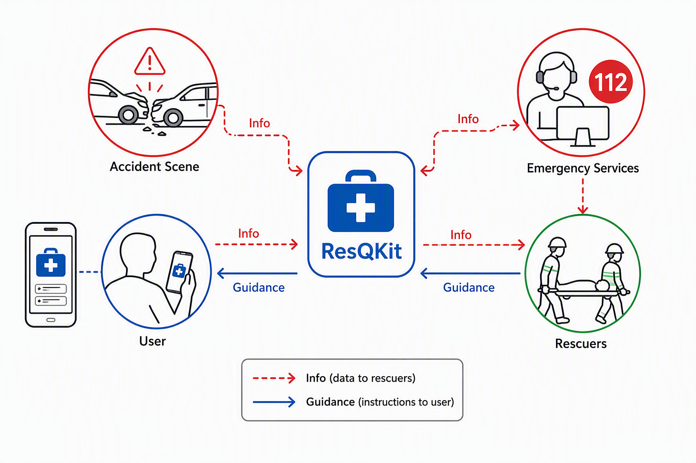
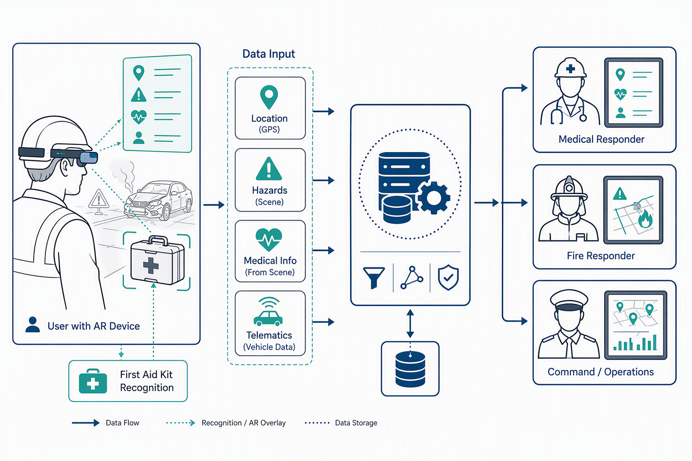
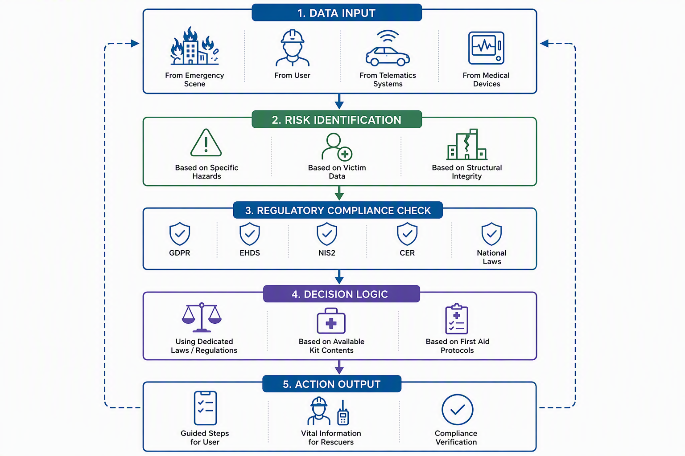
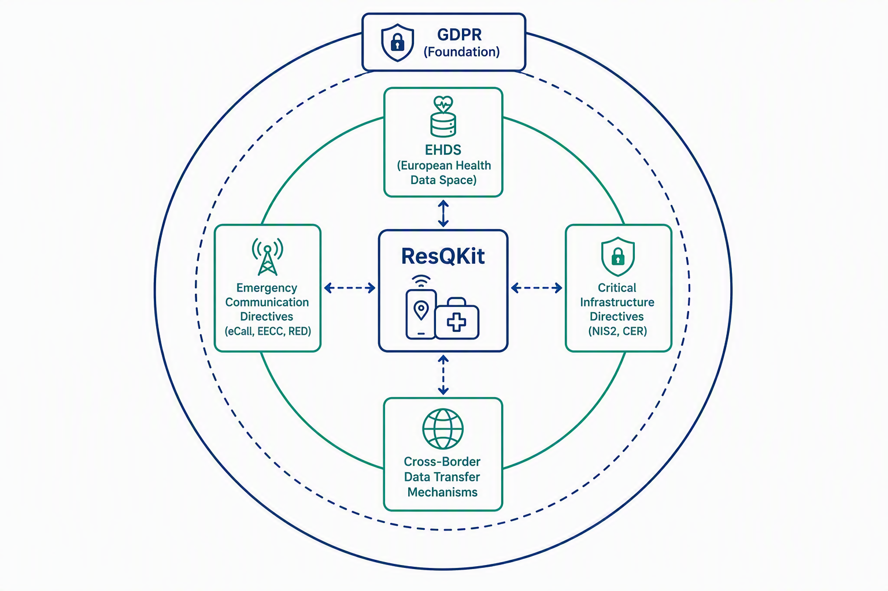
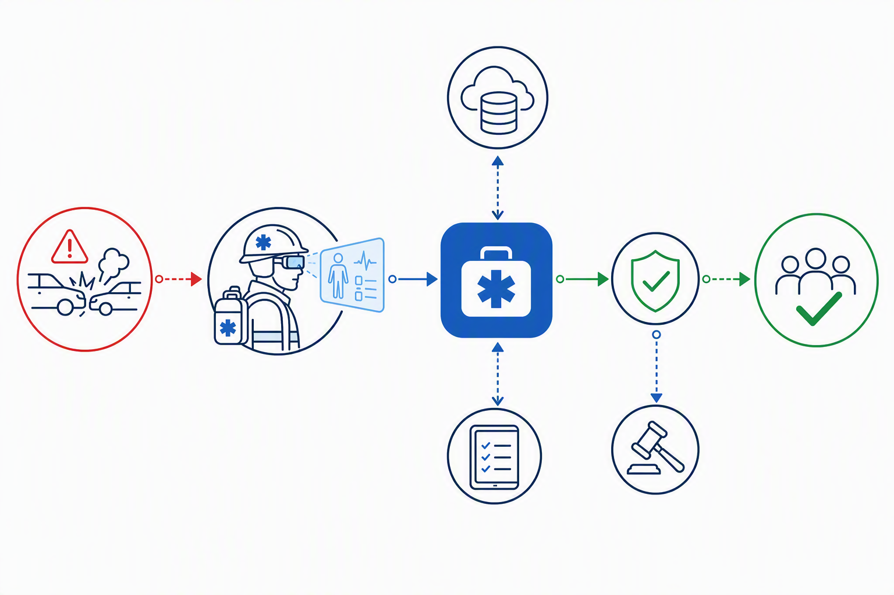

# ResQKit: An Essential Digital Assistant for Enhanced Emergency Response and First Aid

## Introduction: Unveiling ResQKit – Your Essential Accident Assistant

ResQKit is introduced as an innovative, complementary safety tool designed to significantly enhance emergency response and aid in critical accident scenarios. While existing emergency communication channels, such as eCall and the universal 112 emergency number, are vital, they often encounter limitations, including managing false alarms, resolving callback issues, or acquiring precise and comprehensive information efficiently during a crisis <a class="reference" href="https://eena.org/blog/10-years-of-ecall-in-the-eu-milestones-lessons-and-the-road-ahead" target="_blank">1</a>. Furthermore, individuals frequently face gaps in preparedness, struggling to provide immediate and effective first aid or communicate crucial details to rescuers in high-stress situations. ResQKit is engineered to bridge these gaps, ensuring that vital information is swiftly conveyed to emergency services and empowering users with essential guidance and knowledge when it matters most.

The primary purpose of ResQKit is to facilitate rapid and informed decision-making in emergencies. It aims to overcome the inherent challenges faced by users who may lack training in first aid or familiarity with available safety equipment, which can lead to difficulties in handling complex data collection seen in comprehensive assistance services <a class="reference" href="https://www.sos.eu/media/ypinaese/privacy-notice_travelcare_uk_1392024.pdf" target="_blank">4</a>. By doing so, ResQKit acts as a crucial link, enabling a more streamlined and effective response from rescuers while supporting on-site actions by the public.

Core to ResQKit's functionality is its ability to utilize augmented reality (AR) for recognizing and providing insights into the contents of various emergency kits—whether in vehicles, offices, marine environments, or mountainous regions. The application also excels at identifying potential risks and providing context-specific guidance based on dedicated legal frameworks rather than speculative information, thereby accelerating user decisions. This design prioritizes compliance with relevant EU regulations, ensuring data protection and operational integrity in its mission to augment safety and save lives, building upon foundational frameworks like GDPR <a class="reference" href="https://www.dlapiperdataprotection.com?c=DE" target="_blank">5</a>.

  
  

    ResQKit aiding in emergency preparedness
  

## Bridging the Gaps: ResQKit's Core Functionality

ResQKit is designed to enhance emergency response by addressing critical communication gaps and empowering users with vital, accurate, and timely information. Traditional methods of communication, often relying on oral or written reports via radio or phone, are prone to delays, misunderstandings, and inaccuracies, while caller-provided information can be unreliable and slow <a class="reference" href="https://rapidsos.com/blog/telematics-911-crash-response" target="_blank">6</a>. ResQKit directly tackles these deficiencies by ensuring that comprehensive and precise information reaches emergency responders efficiently, facilitating effective decision-making and safeguarding public safety <a class="reference" href="https://chemm.hhs.gov/publicincident.htm" target="_blank">9</a>.

The app ensures critical data points are shared seamlessly with relevant responders. For instance, **exact location** is crucial, with telematics systems providing precise geographical coordinates in vehicle crashes <a class="reference" href="https://rapidsos.com/blog/telematics-911-crash-response" target="_blank">6</a>. The **number of victims** and **type of injury** are primary pieces of information for medical teams and dispatch centers, allowing for appropriate resource allocation and preparation for specific patient needs <a class="reference" href="https://pmc.ncbi.nlm.nih.gov/articles/PMC11977906" target="_blank">11</a>. Access to a victim's **medical history**, including pre-existing conditions, allergies, and current medications, is enabled through potential links to electronic health records (EHR) or smartwatches <a class="reference" href="https://rapidsos.com/blog/telematics-911-crash-response" target="_blank">6</a>. Furthermore, ResQKit communicates **specific hazards**, such as chemical, biological, radiological, nuclear, and explosive (CBRNE) materials <a class="reference" href="https://www.emerald.com/insight/content/doi/10.1108/09653561111178916/full/html" target="_blank">15</a>, structural integrity issues and potential for collapse <a class="reference" href="https://journals.sagepub.com/doi/10.1177/87552930211030297" target="_blank">16</a>, or environmental dangers like air contaminants and extreme weather <a class="reference" href="https://www.ncbi.nlm.nih.gov/books/NBK617007" target="_blank">18</a>. This detailed information is critical for diverse responder types, including medical personnel for patient care coordination <a class="reference" href="https://www.linkedin.com/pulse/saving-minutes-lives-how-data-communication-revolutionizing-emergency-mryqf" target="_blank">13</a>, fire/rescue/HAZMAT teams for hazard identification and extrication <a class="reference" href="https://chemm.hhs.gov/publicincident.htm" target="_blank">9</a>, structural engineers for damage assessments <a class="reference" href="https://journals.sagepub.com/doi/10.1177/87552930211030297" target="_blank">16</a>, and incident command for comprehensive operational oversight and resource allocation <a class="reference" href="https://wcee.nicee.org/wcee/article/17WCEE/6b-0018.pdf" target="_blank">17</a>.

ResQKit also empowers users in first aid by offering real-time, step-by-step guidance for critical procedures. For individuals with limited or no medical training, the app can provide immediate instructions for actions such as Cardiopulmonary Resuscitation (CPR) and Automated External Defibrillator (AED) usage, or managing severe hemorrhage with devices like tourniquets <a class="reference" href="https://github.com/kunalkotkar10/LifeSavAR" target="_blank">19</a>. These applications employ visual prompts and audio cues, sometimes adapting to the user's learning pace and feedback preferences <a class="reference" href="https://www.frontiersin.org/journals/digital-health/articles/10.3389/fdgth.2024.1479544/full" target="_blank">20</a>. Examples such as LifeSavAR and HoloCPR provide AR-guided instructions for such procedures <a class="reference" href="https://github.com/kunalkotkar10/LifeSavAR" target="_blank">19</a>. This guidance is contextualized for various kit types, whether in a car, office, maritime setting, or mountains, leveraging insights from available first-aid kits.

To achieve this, ResQKit utilizes Augmented Reality (AR) for kit and object recognition. AR systems overlay digital information onto the real world, allowing users to interact with both their physical environment and computer-generated content <a class="reference" href="https://xr.jmir.org/2025/1/e66222" target="_blank">22</a>. This capability enables the app to identify and categorize specific objects, such as a first-aid kit or a fire extinguisher, to trigger contextual AR content dynamically <a class="reference" href="https://github.com/krishh-p/train-in-a-snap" target="_blank">23</a>. This enhances situational awareness and decision-making for users and responders alike, reducing on-site confusion and cognitive overload by providing timely and relevant information, including geographic references and tasks <a class="reference" href="https://cspri.engineering.gwu.edu/sites/g/files/zaxdzs5851/files/2023-04/secure-ar-literature-survey_20210722.pdf" target="_blank">25</a>. AR smart glasses, for example, can give paramedics hands-free access to critical data like patient history, allergies, medications, and real-time vitals directly in their field of view <a class="reference" href="https://www.vuzix.com/blogs/white-papers/how-augmented-reality-is-enabling-paramedics" target="_blank">26</a>. They also facilitate "see-what-I-see" remote collaboration, streaming live video to remote physicians for immediate diagnostic guidance and treatment procedures <a class="reference" href="https://www.vuzix.com/blogs/white-papers/how-augmented-reality-is-enabling-paramedics" target="_blank">26</a>.

ResQKit leverages Computer Vision (CV) and Artificial Intelligence (AI) as core underlying technologies. Computer Vision acts as the "eyes" and "brain" of AR, enabling devices to "see" and "understand" their environment through techniques like object recognition, tracking, Simultaneous Localization and Mapping (SLAM), depth sensing, and scene understanding <a class="reference" href="https://www.qodequay.com/computer-vision-and-image-processing-in-ar" target="_blank">24</a>. This allows for accurate placement of virtual elements and credible interaction with real-world objects. AI powers adaptive guidance systems, providing real-time tips and error hints, and can enable smarter AR guidance that adjusts to user performance and learning paths <a class="reference" href="https://github.com/ZENODIUM/AR-Aid-Trainer/" target="_blank">29</a>.

  
  

    ResQKit AR Guidance Overlay
  

## Intelligent Decision Support and Risk Mitigation

Building upon its core functionality of providing critical information to rescuers and assisting first-aid efforts, ResQKit further enhances emergency response through intelligent decision support and robust risk mitigation strategies. The application's mechanism for identifying and mitigating risks is rooted in sophisticated contextual analysis, leveraging real-time data and a deep integration of relevant regulatory frameworks.

ResQKit proactively identifies potential risks by analyzing a wide array of contextual data points specific to an incident. For instance, in motor vehicle crashes, it processes telematics data such as exact location, time, severity of the crash, airbag deployment, and occupant count<a class="reference" href="https://rapidsos.com/blog/telematics-911-crash-response" target="_blank">6</a>, alongside vehicle type, especially for electric or autonomous vehicles, to identify specific extrication hazards<a class="reference" href="https://rapidsos.com/blog/telematics-911-crash-response" target="_blank">6</a>. For HAZMAT incidents, the system integrates immediate agent identification, facility risk information, and environmental monitoring data, assessing risks like chemical properties, flammability, corrosivity, and toxicity<a class="reference" href="https://chemm.hhs.gov/publicincident.htm" target="_blank">9</a>. Similarly, in structural collapses, it evaluates building damage distribution, structural integrity, and utility status to understand immediate dangers and potential for further collapse<a class="reference" href="https://journals.sagepub.com/doi/10.1177/87552930211030297" target="_blank">16</a>. This comprehensive contextual understanding enables ResQKit to provide highly specific risk mitigation advice, contrasting sharply with generic recommendations and ensuring responders are prepared for the exact challenges they face<a class="reference" href="https://www.napsgfoundation.org/wp-content/uploads/2021/11/Technical_Guide_InfoSharingStandards-v3-Final.pdf" target="_blank">7</a>.

  
  

    Intelligent Decision Support Process
  

A cornerstone of ResQKit's intelligent decision support is the direct integration of dedicated EU and Romanian laws and regulations. Unlike systems that offer general advice, ResQKit embeds compliance requirements from instruments such as the General Data Protection Regulation (GDPR) <a class="reference" href="https://www.dlapiperdataprotection.com?c=DE" target="_blank">5</a>, the European Health Data Space (EHDS) <a class="reference" href="https://tandemhealth.ai/resources/knowledge/european-health-data-space-what-clinics-need-to-know" target="_blank">32</a>, the NIS2 Directive, and the Critical Entities Resilience (CER) Directive <a class="reference" href="https://eena.org/wp-content/uploads/2026/05/EENA-report-Emergency-Communications-as-Critical-Infrastructure-1.0.pdf" target="_blank">33</a>. This ensures that all proposed actions and information exchanges are legally sound and compliant. For example, when processing personal or health-related data, ResQKit automatically identifies the necessary legal basis under GDPR Article 6 or specific conditions for sensitive data under Article 9(2), such as explicit consent or vital interests<a class="reference" href="https://pmc.ncbi.nlm.nih.gov/articles/PMC7521575" target="_blank">34</a>. For health data reuse within the EHDS framework, the application adheres to limitations on permitted purposes, explicitly prohibiting use for marketing or detrimental decisions against individuals<a class="reference" href="https://health.ec.europa.eu/ehealth-digital-health-and-care/european-health-data-space-regulation-ehds_en" target="_blank">35</a>. This direct regulatory mapping significantly accelerates decision-making by eliminating the need for manual legal review in high-stress situations and ensuring that guidance is always accurate and relevant, preventing "hallucinations" or misinterpretations of legal requirements.

Furthermore, ResQKit ensures the accuracy and relevance of its guidance by adhering to principles like data minimization, processing only what is adequate, relevant, and necessary for the intended purpose<a class="reference" href="https://trustarc.com/resource/understanding-standard-contractual-clauses-sccs-a-guide-for-businesses" target="_blank">36</a>. It leverages the mandates of the European Electronic Communications Code (EECC) and the Radio Equipment Directive (RED) to ensure accurate caller location information (via Wi-Fi and GNSS) is available to Public Safety Answering Points (PSAPs), which is critical for efficient response<a class="reference" href="https://eur-lex.europa.eu/legal-content/EN/TXT/?uri=uriserv%3AOJ.L_.2023.065.01.0001.01.ENG" target="_blank">2</a>. This accuracy extends to providing real-time patient count and triage status in mass-casualty incidents through technologies like digital triage tags, greatly improving resource allocation compared to traditional reporting<a class="reference" href="https://link.springer.com/article/10.1186/s12873-025-01274-0" target="_blank">8</a>. By adopting and mandating common data standards, such as HL7 FHIR for health data under the EHDS, ResQKit facilitates consistent and machine-readable health data exchange, bolstering interoperability and the precision of medical guidance<a class="reference" href="https://tandemhealth.ai/resources/knowledge/european-health-data-space-what-clinics-need-to-know" target="_blank">32</a>.

ResQKit's unwavering commitment to EU and Romanian regulatory compliance underpins its operational security and data handling practices. The application is designed with "Privacy by Design and by Default" (GDPR Article 25) <a class="reference" href="https://www.edpb.europa.eu/system/files/2021-03/edpb_guidelines_202001_connected_vehicles_v2.0_adopted_en.pdf" target="_blank">38</a>, incorporating measures like pseudonymization and encryption, particularly crucial for cross-border data transfers to mitigate risks associated with third-country laws<a class="reference" href="https://www.openforest.co/glossary/cross-border-data-transfer" target="_blank">40</a>. Data Protection Impact Assessments (DPIAs) are conducted for any high-risk processing activities involving sensitive data<a class="reference" href="https://www.edpb.europa.eu/system/files/2021-03/edpb_guidelines_202001_connected_vehicles_v2.0_adopted_en.pdf" target="_blank">38</a>. The EHDS framework further specifies secure processing environments for health data, emphasizing data subject rights including access, rectification, and control over their health information<a class="reference" href="https://tandemhealth.ai/resources/knowledge/european-health-data-space-what-clinics-need-to-know" target="_blank">32</a>. Even for specialized services like eCall, ResQKit respects specific data protection rules, such as limiting data collection and storage periods and requiring explicit consent for Third-Party Service (TPS) eCall systems that process additional personal data<a class="reference" href="https://europa.eu/youreurope/citizens/travel/security-and-emergencies/emergency-assistance-vehicles-ecall/index_en.htm" target="_blank">43</a>. This multi-layered approach ensures that ResQKit not only assists in emergencies but does so with the highest standards of data protection and operational integrity.

## Regulatory Compliance and Trust

ResQKit is meticulously designed to operate within the robust regulatory landscape of the European Union, specifically addressing emergency services, stringent data privacy, and digital safety. This commitment extends to ensuring full compliance with Romanian national laws governing emergency response and medical assistance applications, thereby building reliability, fostering user trust, and securing official recognition.

### Foundational EU Data Protection Frameworks

At the core of ResQKit's data handling practices is the General Data Protection Regulation (GDPR) - Regulation (EU) 2016/679. This directly applicable EU law governs the processing of personal data for all organizations established in the EU or those processing data of data subjects within the Union <a class="reference" href="https://www.dlapiperdataprotection.com?c=DE" target="_blank">5</a>. For emergency applications like ResQKit, which handle sensitive personal and health-related data, adherence to GDPR is paramount.

Processing personal data within ResQKit will always be based on clearly identified legal bases. For emergency situations, Article 6(1)(d) (vital interests of the data subject) or (e) (public interest) may be relevant. When dealing with "special categories" of personal data, such as health information, specific conditions under Article 9(2) are crucial, including explicit consent from the individual, substantial public interest, or vital interests <a class="reference" href="https://pmc.ncbi.nlm.nih.gov/articles/PMC7521575" target="_blank">34</a>.

ResQKit's operation will embed GDPR's core principles:
*   **Lawfulness, Fairness, and Transparency**: Data processing will be clear and justifiable <a class="reference" href="https://pmc.ncbi.nlm.nih.gov/articles/PMC7521575" target="_blank">34</a>.
*   **Purpose Limitation**: Data collected will be processed only for specified, explicit, and legitimate emergency response purposes <a class="reference" href="https://trustarc.com/resource/understanding-standard-contractual-clauses-sccs-a-guide-for-businesses" target="_blank">36</a>.
*   **Data Minimization**: Processing will be limited to data that is adequate, relevant, and necessary for the intended purpose <a class="reference" href="https://trustarc.com/resource/understanding-standard-contractual-clauses-sccs-a-guide-for-businesses" target="_blank">36</a>.
*   **Accuracy, Storage Limitation, Integrity, and Confidentiality**: Data will be accurate, securely stored, and retained no longer than necessary <a class="reference" href="https://europa.eu/youreurope/citizens/travel/security-and-emergencies/emergency-assistance-vehicles-ecall/index_en.htm" target="_blank">43</a>.
*   **Accountability**: ResQKit will maintain clear records and processes to demonstrate compliance <a class="reference" href="https://www.debevoisedatablog.com/2020/12/01/new-edpb-guidance-sccs-cross-border-data-transfers" target="_blank">41</a>.

The roles of "controller" (determining processing purposes) and "processor" (processing data on behalf of the controller) will be clearly defined within ResQKit's operational framework, aligning with GDPR requirements <a class="reference" href="https://www.dlapiperdataprotection.com?c=DE" target="_blank">5</a>.

### Sector-Specific EU Regulations for Emergency & Health Data

ResQKit's functionalities are shaped by several EU sector-specific regulations:

*   **Emergency Communications**:
    *   **eCall Initiatives**: While ResQKit is a complementary app, understanding eCall's framework is vital. eCall automatically transmits a Minimum Set of Data (MSD) including location and vehicle information during serious accidents, demonstrating a privacy-by-design approach by limiting collected data and storage duration <a class="reference" href="https://europa.eu/youreurope/citizens/travel/security-and-emergencies/emergency-assistance-vehicles-ecall/index_en.htm" target="_blank">43</a>. This informs ResQKit's design for data minimization in emergency contexts.
    *   **European Electronic Communications Code (EECC)**: The EECC defines "emergency communication" and mandates that Member States ensure caller location information is available to Public Safety Answering Points (PSAPs) for '112' calls (Article 109) <a class="reference" href="https://eena.org/wp-content/uploads/2026/05/EENA-report-Emergency-Communications-as-Critical-Infrastructure-1.0.pdf" target="_blank">33</a>. ResQKit will leverage and contribute to this requirement by providing precise location data.
    *   **Radio Equipment Directive (RED)**: This directive ensures radio equipment supports features for emergency services, including the provision of Wi-Fi and Global Navigation Satellite System (GNSS) location information compatible with Galileo from handheld mobile telephones, significantly improving location accuracy for emergency communications <a class="reference" href="https://eur-lex.europa.eu/legal-content/EN/TXT/HTML/?uri=CELEX%3A32019R0320" target="_blank">3</a>.

*   **Critical Infrastructure Security**: ResQKit recognizes that the underlying communication channels and data infrastructure supporting emergency response are critical. Compliance with the **NIS2 Directive** (Network and Information Systems Directive) and the **Critical Entities Resilience (CER) Directive** will strengthen the cybersecurity and resilience of ResQKit's supporting systems, positioning them as reliable components of critical infrastructure <a class="reference" href="https://eena.org/wp-content/uploads/2026/05/EENA-report-Emergency-Communications-as-Critical-Infrastructure-1.0.pdf" target="_blank">33</a>.

*   **Health Data Governance**:
    *   **European Health Data Space (EHDS)**: As ResQKit handles health-related data, it will align with the EHDS, which entered into force in March 2025. This regulation applies to healthcare providers handling electronic health data and aims to empower individuals with control over their data, enable secure reuse, and foster a single market for digital health services <a class="reference" href="https://tandemhealth.ai/resources/knowledge/european-health-data-space-what-clinics-need-to-know" target="_blank">32</a>. ResQKit will adhere to the EHDS's mandated common data standards and technical formats, such as HL7 FHIR, to ensure consistent and machine-readable health data exchange <a class="reference" href="https://tandemhealth.ai/resources/knowledge/european-health-data-space-what-clinics-need-to-know" target="_blank">32</a>.
    *   **MyHealth@EU**: The eHealth Digital Services Infrastructure (eHDSI), including MyHealth@EU, facilitates cross-border electronic transmission of patient summaries. ResQKit's ability to communicate vital information to rescuers could, where relevant and consented, integrate with or inform such systems, with personal data processed according to GDPR and national law <a class="reference" href="https://ec.europa.eu/assets/sante/health/pins/Czechia/czech_psb_english.pdf" target="_blank">42</a>.

*   **EU Civil Protection Mechanism**: ResQKit's function of communicating vital information in emergencies aligns with the EU Civil Protection Mechanism, which coordinates assistance in crises and uses the Common Emergency Communication and Information System (CECIS) for real-time information exchange <a class="reference" href="https://reliefweb.int/report/world/questions-and-answers-instrument-emergency-assistance-within-union" target="_blank">45</a>.

### Cross-Border Data Transfer Compliance

The GDPR's robust personal data protection rules extend to transfers outside the EU/EEA (Chapter V, Articles 44-50), ensuring consistent safeguards regardless of data location <a class="reference" href="https://commission.europa.eu/law/law-topic/data-protection/information-business-and-organisations/obligations/what-rules-apply-if-my-organisation-transfers-data-outside-eu_en" target="_blank">47</a>. ResQKit will diligently adhere to these rules:

*   **Adequacy Decisions**: Data can be transferred to non-EU countries deemed by the European Commission to offer an adequate level of data protection without additional safeguards, such as the UK or the US for organizations participating in the EU-US Data Privacy Framework <a class="reference" href="https://commission.europa.eu/law/law-topic/data-protection/information-business-and-organisations/obligations/what-rules-apply-if-my-organisation-transfers-data-outside-eu_en" target="_blank">47</a>.
*   **Standard Contractual Clauses (SCCs)**: For transfers to countries without an adequacy decision, ResQKit will utilize SCCs, which are pre-approved model data protection clauses that create contractual obligations for data exporters and importers to uphold GDPR-like standards <a class="reference" href="https://commission.europa.eu/law/law-topic/data-protection/international-dimension-data-protection/standard-contractual-clauses-scc_en" target="_blank">49</a>.
    *   The **Schrems II Judgment** significantly impacts the use of SCCs, requiring organizations to conduct a Transfer Impact Assessment (TIA) to determine if the laws of the third country could undermine SCC compliance <a class="reference" href="https://developer.atlassian.com/platform/marketplace/standard-contractual-clauses-cross-border" target="_blank">51</a>. If necessary, supplementary technical or organizational measures (e.g., encryption, pseudonymization) will be implemented to ensure adequate protection; otherwise, transfers will cease <a class="reference" href="https://www.debevoisedatablog.com/2020/12/01/new-edpb-guidance-sccs-cross-border-data-transfers" target="_blank">41</a>.
*   **Binding Corporate Rules (BCRs)**: For internal data transfers within a multinational group supporting ResQKit, BCRs could serve as a robust mechanism, approved by data protection authorities <a class="reference" href="https://commission.europa.eu/law/law-topic/data-protection/information-business-and-organisations/obligations/what-rules-apply-if-my-organisation-transfers-data-outside-eu_en" target="_blank">47</a>.
*   **Derogations for Specific Situations**: Limited exceptions under Article 49 allow transfers without an adequacy decision or SCCs in specific circumstances, such as with explicit individual consent or necessity for performing a contract. These are not for systematic transfers <a class="reference" href="https://www.sos.eu/media/ypinaese/privacy-notice_travelcare_uk_1392024.pdf" target="_blank">4</a>.

| Transfer Mechanism | Description/Conditions | GDPR Article Reference(s) |
| :--- | :--- | :--- |
| Adequacy Decisions | European Commission determines if a non-EU country offers an adequate level of data protection; data can flow without additional safeguards. Subject to periodic review. | Article 45 |
| Standard Contractual Clauses (SCCs) | Pre-approved model data protection clauses for transfers to countries without an adequacy decision. Create contractual obligations for data exporter and importer. *Schrems II* judgment requires Transfer Impact Assessment (TIA) and supplementary measures. | Chapter V (Articles 44-50) |
| Binding Corporate Rules (BCRs) | Internal policies for multinational corporate groups, approved by data protection authorities, to ensure intra-group data transfers comply with EU standards. Complex, suitable for large organizations. | Chapter V (Articles 44-50) |
| Derogations for Specific Situations | Limited exceptions for transfers in specific circumstances without an adequacy decision or SCCs (e.g., explicit consent from the individual, necessity for performing a contract). Not intended for systematic or large-scale transfers. | Article 49 |

### Operationalizing Compliance: Technical & Organizational Measures

ResQKit's compliance is operationalized through a suite of technical and organizational measures designed to protect data throughout its lifecycle:

*   **Privacy by Design and Default**: Aligned with GDPR Article 25, data protection principles will be integrated into the fundamental design and default settings of ResQKit, as emphasized by EDPB guidelines for connected technologies <a class="reference" href="https://www.edpb.europa.eu/system/files/2021-03/edpb_guidelines_202001_connected_vehicles_v2.0_adopted_en.pdf" target="_blank">38</a>.
*   **Data Protection Impact Assessments (DPIAs)**: Given the sensitive nature of health and personal data processed in emergency contexts, DPIAs will be regularly conducted for any high-risk processing activities, as mandated by GDPR Article 35, to identify and mitigate privacy risks <a class="reference" href="https://www.edpb.europa.eu/system/files/2021-03/edpb_guidelines_202001_connected_vehicles_v2.0_adopted_en.pdf" target="_blank">38</a>.
*   **Pseudonymization and Encryption**: These measures will be deployed to protect data, especially for sensitive health information and cross-border transfers, mitigating risks associated with potential government access in third countries <a class="reference" href="https://tandemhealth.ai/resources/knowledge/european-health-data-space-what-clinics-need-to-know" target="_blank">32</a>.
*   **Robust Security Frameworks and Access Controls**: ResQKit will implement comprehensive security frameworks, including strict access controls, regular staff training, and potentially leveraging ISO-27001 (information security) and ISO-27701 (privacy) certifications to demonstrate robust data protection, as practiced by industry leaders like SOS International <a class="reference" href="https://www.sos.eu/media/ypinaese/privacy-notice_travelcare_uk_1392024.pdf" target="_blank">4</a>.
*   **Secure Processing Environments and Auditing**: The EHDS framework's focus on secure processing environments for sensitive health data will guide ResQKit's infrastructure <a class="reference" href="https://tehdas.eu/wp-content/uploads/2025/01/2025-01-20-tehdas2-milestone-5.1.pdf" target="_blank">37</a>. Comprehensive logging and auditing mechanisms, similar to MyHealth@EU's approach for traceability and non-repudiation, will be integrated to ensure accountability and monitor data flows <a class="reference" href="https://ec.europa.eu/assets/sante/health/pins/Czechia/czech_psb_english.pdf" target="_blank">42</a>.

  
  

    Diagram illustrating the layers of ResQKit's compliance framework
  

### Addressing Compliance Challenges & Best Practices

ResQKit acknowledges the inherent challenges in regulatory compliance, particularly in emergency contexts, and commits to best practices:

*   **Balancing Emergency Needs and Data Protection**: A core challenge is reconciling the urgent need for comprehensive data in emergencies with individuals' fundamental privacy rights <a class="reference" href="https://pmc.ncbi.nlm.nih.gov/articles/PMC7521575" target="_blank">34</a>. ResQKit's design will prioritize data minimization while ensuring critical information reaches rescuers efficiently.
*   **Complex Cross-Border Transfers**: The dynamic legal landscape for international data transfers, especially post-*Schrems II*, demands continuous monitoring and adaptation. ResQKit will ensure regular review and update of data processing practices and contracts related to transfers <a class="reference" href="https://pmc.ncbi.nlm.nih.gov/articles/PMC8216070" target="_blank">52</a>.
*   **Interoperability**: Achieving seamless and secure data exchange across diverse emergency and health data systems is a significant technical and organizational hurdle. ResQKit will commit to adopting and adhering to mandated standards, such as HL7 FHIR for health data, to facilitate interoperability and cross-border data portability <a class="reference" href="https://tandemhealth.ai/resources/knowledge/european-health-data-space-what-clinics-need-to-know" target="_blank">32</a>.
*   **Transparent Consent and Data Subject Rights**: Implementing mechanisms for transparent, explicit consent, especially for sensitive data and additional services, is crucial. ResQKit will ensure individuals can easily exercise their data subject rights, including access, rectification, erasure, and withdrawal of consent <a class="reference" href="https://europa.eu/youreurope/citizens/travel/security-and-emergencies/emergency-assistance-vehicles-ecall/index_en.htm" target="_blank">43</a>.
*   **Continuous Compliance Monitoring**: Regular review of data processing activities, particularly in response to evolving regulations and official guidance from bodies like the European Data Protection Board (EDPB) and European Commission (EC), will be a cornerstone of ResQKit's strategy <a class="reference" href="https://www.edpb.europa.eu/topics/international-transfers-and-international-cooperation/standard-contractual-clauses_en" target="_blank">50</a>.

### Romanian National Law Integration

Beyond the comprehensive EU framework, ResQKit will undertake a thorough analysis and ensure full compliance with specific Romanian national laws governing emergency response and medical assistance applications. This includes aligning with local interpretations of EU directives and any unique national legislative requirements, thereby ensuring the application's legal standing and operational effectiveness within Romania. This local integration is critical for official recognition and trust within the national emergency services ecosystem.

## Conclusion: A Safer Tomorrow with ResQKit

ResQKit emerges as a vital, complementary tool designed to bridge critical gaps in emergency response, ultimately fostering safer environments and improving accident outcomes. The application’s core strength lies in its ability to deliver **enhanced communication** by leveraging accurate, timely data from sources like vehicle telematics and advanced caller location information <a class="reference" href="https://rapidsos.com/blog/telematics-911-crash-response" target="_blank">6</a>. This ensures that emergency services receive precise incident details promptly, integrating seamlessly with existing emergency channels.

Furthermore, ResQKit facilitates **informed first aid** through augmented reality (AR) guidance, offering step-by-step instructions for critical procedures such as CPR and AED usage <a class="reference" href="https://github.com/kunalkotkar10/LifeSavAR" target="_blank">19</a>, and assisting users in recognizing and utilizing available first aid kit contents <a class="reference" href="https://www.qodequay.com/computer-vision-and-image-processing-in-ar" target="_blank">24</a>. This empowers individuals, even those with limited medical training, to act effectively during emergencies. The provision of comprehensive information, including victim counts, injury types, and medical histories, is crucial for rescuers to prepare and allocate resources efficiently <a class="reference" href="https://pmc.ncbi.nlm.nih.gov/articles/PMC11977906" target="_blank">11</a>.

The app’s intelligent integration supports **rapid decision-making** for both lay responders and professionals. AR systems enhance situational awareness for first responders by providing critical information like patient history, allergies, and treatment protocols directly in their field of view, reducing on-site confusion and cognitive overload <a class="reference" href="https://www.vuzix.com/blogs/white-papers/how-augmented-reality-is-enabling-paramedics" target="_blank">26</a>. This immediate access to essential data, from exact incident locations to specific hazards, is vital for efficient response and effective decision-making <a class="reference" href="https://chemm.hhs.gov/publicincident.htm" target="_blank">9</a>.

Crucially, ResQKit is engineered with robust attention to **regulatory compliance**, adhering to fundamental EU legislative instruments such as the General Data Protection Regulation (GDPR) <a class="reference" href="https://www.dlapiperdataprotection.com?c=DE" target="_blank">5</a>, eCall mandates <a class="reference" href="https://europa.eu/youreurope/citizens/travel/security-and-emergencies/emergency-assistance-vehicles-ecall/index_en.htm" target="_blank">43</a>, and the European Electronic Communications Code (EECC) <a class="reference" href="https://eena.org/wp-content/uploads/2026/05/EENA-report-Emergency-Communications-as-Critical-Infrastructure-1.0.pdf" target="_blank">33</a>. The integration of the European Health Data Space (EHDS) principles further ensures secure and interoperable handling of health-related data <a class="reference" href="https://tandemhealth.ai/resources/knowledge/european-health-data-space-what-clinics-need-to-know" target="_blank">32</a>, prioritizing data protection by design and default, and mitigating compliance challenges in cross-border data transfers <a class="reference" href="https://www.openforest.co/glossary/cross-border-data-transfer" target="_blank">40</a>.

By enhancing communication, informing first aid, and accelerating decision-making while upholding strict regulatory standards, ResQKit significantly contributes to improving accident outcomes and creating safer communities. Studies have shown that AR-based solutions can lead to faster skill acquisition, improved retention, decreased reaction times, and increased procedural accuracy in emergency scenarios <a class="reference" href="https://www.vuzix.com/blogs/white-papers/how-augmented-reality-is-enabling-paramedics" target="_blank">26</a>.

The future trajectory for ResQKit includes exploring deeper integration with advanced AI for dynamic, personalized guidance and adaptive learning paths <a class="reference" href="https://github.com/ZENODIUM/AR-Aid-Trainer/" target="_blank">29</a>. Further development could also focus on enhanced interactivity, including haptic feedback and multi-user training scenarios, and expanding its application to even more complex emergency situations <a class="reference" href="https://github.com/ZENODIUM/AR-Aid-Trainer/" target="_blank">29</a>. Integration with existing medical protocols and hospital information systems via standards like FHIR presents a powerful avenue for continuous evolution, ensuring ResQKit remains at the forefront of emergency assistance technology <a class="reference" href="https://www.vuzix.com/blogs/white-papers/how-augmented-reality-is-enabling-paramedics" target="_blank">26</a>.

  
  

    Conceptual image of the ResQKit application
  

<h2>References</h2>

[1] <a href="https://eena.org/blog/10-years-of-ecall-in-the-eu-milestones-lessons-and-the-road-ahead" target="_blank">10 years of eCall in the EU: Milestones, lessons, ...</a>

[2] <a href="https://eur-lex.europa.eu/legal-content/EN/TXT/?uri=uriserv%3AOJ.L_.2023.065.01.0001.01.ENG" target="_blank">Delegated regulation - 2023/444 - EN - EUR-Lex</a>

[3] <a href="https://eur-lex.europa.eu/legal-content/EN/TXT/HTML/?uri=CELEX%3A32019R0320" target="_blank">L_2019055EN.01000101.xml</a>

[4] <a href="https://www.sos.eu/media/ypinaese/privacy-notice_travelcare_uk_1392024.pdf" target="_blank">(Travelcare)</a>

[5] <a href="https://www.dlapiperdataprotection.com?c=DE" target="_blank">Data protection laws in Germany</a>

[6] <a href="https://rapidsos.com/blog/telematics-911-crash-response" target="_blank">The Power of Data: 3 Ways Telematics Saves Lives i...</a>

[7] <a href="https://www.napsgfoundation.org/wp-content/uploads/2021/11/Technical_Guide_InfoSharingStandards-v3-Final.pdf" target="_blank">Technical Guide: Incident Management Technology</a>

[8] <a href="https://link.springer.com/article/10.1186/s12873-025-01274-0" target="_blank">A real-time communication and information system f...</a>

[9] <a href="https://chemm.hhs.gov/publicincident.htm" target="_blank">Public Incident - CHEMM</a>

[10] <a href="https://chemm.hhs.gov/detailedinfo.htm" target="_blank">Initial Response to a Chemical Hazardous Materials...</a>

[11] <a href="https://pmc.ncbi.nlm.nih.gov/articles/PMC11977906" target="_blank">Concrete silo collapse: emergency medical services...</a>

[12] <a href="https://link.springer.com/article/10.1186/s13049-025-01376-5" target="_blank">Concrete silo collapse: emergency medical services...</a>

[13] <a href="https://www.linkedin.com/pulse/saving-minutes-lives-how-data-communication-revolutionizing-emergency-mryqf" target="_blank">Saving minutes, saving lives: How Data Communicati...</a>

[14] <a href="https://www.apcointl.org/~documents/standard/21021-2022-aacn-vehicle-data-set-veds?layout=file" target="_blank">DOCUMENT TITLE</a>

[15] <a href="https://www.emerald.com/insight/content/doi/10.1108/09653561111178916/full/html" target="_blank">Identification of local information items needed d...</a>

[16] <a href="https://journals.sagepub.com/doi/10.1177/87552930211030297" target="_blank">Factors affecting earthquake responders’ building ...</a>

[17] <a href="https://wcee.nicee.org/wcee/article/17WCEE/6b-0018.pdf" target="_blank">POST-DISASTER SAFETY EVALUATION GUIDANCE</a>

[18] <a href="https://www.ncbi.nlm.nih.gov/books/NBK617007" target="_blank">ENVIRONMENTAL HEALTH AND EMERGENCY PREPAREDNESS - ...</a>

[19] <a href="https://github.com/kunalkotkar10/LifeSavAR" target="_blank">kunalkotkar10/LifeSavAR</a>

[20] <a href="https://www.frontiersin.org/journals/digital-health/articles/10.3389/fdgth.2024.1479544/full" target="_blank">Frontiers | Augmented Reality for extremity hemorr...</a>

[21] <a href="https://hxi.ucsd.edu/papers/holocpr_2018_PH_preprint.pdf" target="_blank">HoloCPR: Designing and Evaluating a Mixed Reality ...</a>

[22] <a href="https://xr.jmir.org/2025/1/e66222" target="_blank">Applications of Augmented Reality for Prehospital ...</a>

[23] <a href="https://github.com/krishh-p/train-in-a-snap" target="_blank">krishh-p/train-in-a-snap</a>

[24] <a href="https://www.qodequay.com/computer-vision-and-image-processing-in-ar" target="_blank">Pixel to Presence: Image Processing in AR</a>

[25] <a href="https://cspri.engineering.gwu.edu/sites/g/files/zaxdzs5851/files/2023-04/secure-ar-literature-survey_20210722.pdf" target="_blank">[PDF] Secure Augmented Reality (AR) for Telehealth...</a>

[26] <a href="https://www.vuzix.com/blogs/white-papers/how-augmented-reality-is-enabling-paramedics" target="_blank">How Augmented Reality Is Enabling Paramedics – Vuz...</a>

[27] <a href="https://viso.ai/computer-vision/augmented-reality-virtual-reality" target="_blank">Explore Computer Vision's Role in AR and VR</a>

[28] <a href="https://dev.to/angelika_berd/the-role-of-computer-vision-in-advancing-augmented-reality-experiences-3dbd" target="_blank">The Role of Computer Vision in Advancing Augmented...</a>

[29] <a href="https://github.com/ZENODIUM/AR-Aid-Trainer/" target="_blank">ZENODIUM/AR-Aid-Trainer</a>

[30] <a href="https://www.acs.org/about/governance/committees/chemical-safety/publications-resources/guide-for-chemical-spill-response.html" target="_blank">Guide for Chemical Spill Response</a>

[31] 

[32] <a href="https://tandemhealth.ai/resources/knowledge/european-health-data-space-what-clinics-need-to-know" target="_blank">European Health Data Space: What clinics need to k...</a>

[33] <a href="https://eena.org/wp-content/uploads/2026/05/EENA-report-Emergency-Communications-as-Critical-Infrastructure-1.0.pdf" target="_blank">EMERGENCY COMMUNICATIONS AS CRITICAL INFRASTRUCTUR...</a>

[34] <a href="https://pmc.ncbi.nlm.nih.gov/articles/PMC7521575" target="_blank">Privacy in emergency circumstances: data protectio...</a>

[35] <a href="https://health.ec.europa.eu/ehealth-digital-health-and-care/european-health-data-space-regulation-ehds_en" target="_blank">European Health Data Space Regulation (EHDS)</a>

[36] <a href="https://trustarc.com/resource/understanding-standard-contractual-clauses-sccs-a-guide-for-businesses" target="_blank">Understanding Standard Contractual Clauses (SCCs):...</a>

[37] <a href="https://tehdas.eu/wp-content/uploads/2025/01/2025-01-20-tehdas2-milestone-5.1.pdf" target="_blank">M5.1 Draft guideline on data description</a>

[38] <a href="https://www.edpb.europa.eu/system/files/2021-03/edpb_guidelines_202001_connected_vehicles_v2.0_adopted_en.pdf" target="_blank">Guidelines 01/2020 on processing personal data in ...</a>

[39] <a href="https://www.passwordprotectedlaw.com/2018/02/ecall-privacy-and-data-protection-implications" target="_blank">eCall: Privacy and Data Protection Implications | ...</a>

[40] <a href="https://www.openforest.co/glossary/cross-border-data-transfer" target="_blank">Cross-Border Data Transfer | Open Forest Glossary</a>

[41] <a href="https://www.debevoisedatablog.com/2020/12/01/new-edpb-guidance-sccs-cross-border-data-transfers" target="_blank">New EU guidance & SCCs on cross-border data transf...</a>

[42] <a href="https://ec.europa.eu/assets/sante/health/pins/Czechia/czech_psb_english.pdf" target="_blank">3. What is the legal basis for the use of your per...</a>

[43] <a href="https://europa.eu/youreurope/citizens/travel/security-and-emergencies/emergency-assistance-vehicles-ecall/index_en.htm" target="_blank">eCall 112-based emergency assistance from your veh...</a>

[44] <a href="https://www.bmimi.gv.at/en/topics/transport/roads/ecall.html" target="_blank">112 eCall – Frequently Asked Questions</a>

[45] <a href="https://reliefweb.int/report/world/questions-and-answers-instrument-emergency-assistance-within-union" target="_blank">Questions and Answers: An instrument for Emergency...</a>

[46] <a href="https://micicinitiative.iom.int/eu-civil-protection-mechanism" target="_blank">EU Civil Protection Mechanism</a>

[47] <a href="https://commission.europa.eu/law/law-topic/data-protection/information-business-and-organisations/obligations/what-rules-apply-if-my-organisation-transfers-data-outside-eu_en" target="_blank">What rules apply if my organisation transfers data...</a>

[48] <a href="https://commission.europa.eu/law/law-topic/data-protection/international-dimension-data-protection/adequacy-decisions_en" target="_blank">Data protection adequacy for non-EU countries</a>

[49] <a href="https://commission.europa.eu/law/law-topic/data-protection/international-dimension-data-protection/standard-contractual-clauses-scc_en" target="_blank">Standard Contractual Clauses (SCC) - European Comm...</a>

[50] <a href="https://www.edpb.europa.eu/topics/international-transfers-and-international-cooperation/standard-contractual-clauses_en" target="_blank">Standard contractual clauses | European Data Prote...</a>

[51] <a href="https://developer.atlassian.com/platform/marketplace/standard-contractual-clauses-cross-border" target="_blank">Standard contractual clauses (SCCs) and cross-bord...</a>

[52] <a href="https://pmc.ncbi.nlm.nih.gov/articles/PMC8216070" target="_blank">Standard contractual clauses for cross-border tran...</a>

[53] <a href="https://www.sos.eu/en/legal/consent-declaration-create-case/" target="_blank">SOS International | SOS International</a>

[54] <a href="https://commission.europa.eu/law/law-topic/data-protection/international-dimension-data-protection/new-standard-contractual-clauses-questions-and-answers-overview_en" target="_blank">New Standard Contractual Clauses - Questions and A...</a>

[55] <a href="https://humanfactors.jmir.org/2026/1/e78144" target="_blank">JMIR Human Factors - Overview of a User-Centered, ...</a>

